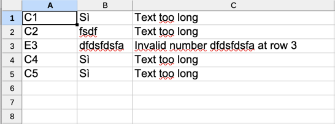

# Import Rows from csv, xls and xlsx

It is possible to start importing data from a csv, xls and xlsx file also from javascript server actions.

**Syntax**:

```javascript
utils.importRowsFromFile(
      Long dirId, 
      String fileName, 
      Long importId,
      boolean insert, 
      Long maxErrors, 
      Long maxRowErrors, 
      Map inputData, 
      Long destErrorsFileDirId, 
      String destErrorsFileName,
      boolean rollbackIfErrors,
      boolean async 
);
```

| Argument            | Description                                                                                                                                                                                                                                                                                                                                                 |
| ------------------- | ----------------------------------------------------------------------------------------------------------------------------------------------------------------------------------------------------------------------------------------------------------------------------------------------------------------------------------------------------------- |
| dirId               | id of the directory where to search the file                                                                                                                                                                                                                                                                                                                |
| fileName            | file name                                                                                                                                                                                                                                                                                                                                                   |
| importId            | id of import (\*)                                                                                                                                                                                                                                                                                                                                           |
| insert              | true if you want insert the rows; false if you want insert or update the rows                                                                                                                                                                                                                                                                               |
| maxErrors           | <p>(optional) number of errors to block the reading of file. </p><p>null: the file is read to the end</p><p>1: reading of the file stops at the first error</p><p>n: reading the file stops at error number n</p>                                                                                                                                           |
| maxRowErrors        | <p>(optional) number of errors to block the process of row</p><p>null: the line is read completely even in case of errors</p><p>1: processing of the line stops at the first error</p><p>n: processing of the line stops at error number n</p><p>when you reach the maximum number of errors for line, the line is discarded and you go to the next one</p> |
| inputData           | (optional) map of variables or data to use to insert/update the rows                                                                                                                                                                                                                                                                                        |
| destErrorsFileDirId | (optional) id of the directory where saving the errors file                                                                                                                                                                                                                                                                                                 |
| destErrorsFileName  | (optional) name of errors file                                                                                                                                                                                                                                                                                                                              |
| rollbackIfErrors    | true: if there are errors it cancels everything; false: confirms only the successfully imported rows                                                                                                                                                                                                                                                        |
| async               | true: the process send an alert to user when is finished                                                                                                                                                                                                                                                                                                    |

(\*) You can configure the import [here](https://4wsplatform.gitbook.io/user-guide/core-features/defining-the-ui/3-1-app-designer/3-1-24-bulk-import-binded-to-a-grid)

**Example**:

```javascript
utils.importRowsFromFile(
      9, 
      "example.xlsx", 
      9,
      true, 
      10, 
      2, 
      { "FIELD1": 123, "USERNAME": "TEST_USER" }, 
      9, 
      "errors_of_example.xlsx",
      true,
      true 
);
```

This is an example of errors file\
Column A: coordinate of error cell\
Column B: value in cell\
Column C: type of error


